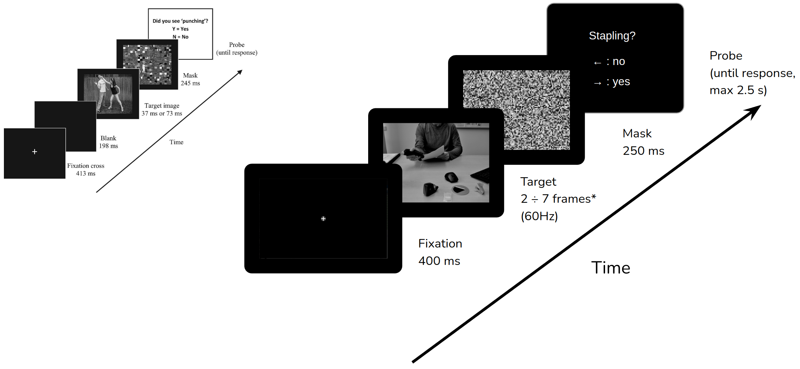

# Brief Actions in Context : Behavioral experiment [AinC]
## *How are briefly-presented actions percieved in congruent vs incongruent contexts?*

## Trial structure 

[Hafri, Papafragou, Trueswell - Getting the gist of events (2013)](http://content.apa.org/journals/xge/142/3/880)

## Functionality

1. Stimuli-related
    - create masks using random tiles : `createMasks()`
    - create stimulus definition file (std) : `createStimDefs()`
2. Trial Definition
    - create template blocks with all conditions present ONCE per block: `makeTRDTemplate(nBlocks)`
    - create trials for a full experiment using template blocks : [`fillTRD(subjectID, nBlocks, lBlock, RespKeys, writeTRD)`](fillTRD.m)
3. Data analysis
    - extract response time (RT) statistics : `computeRTstatistics(ExpInfo, ...)`
    - compute sensitivity (d-prime) : `computeSensitivity(ExpInfo, ...)`

---

Derived from https://github.com/CogNeuroUR/ASF-examples