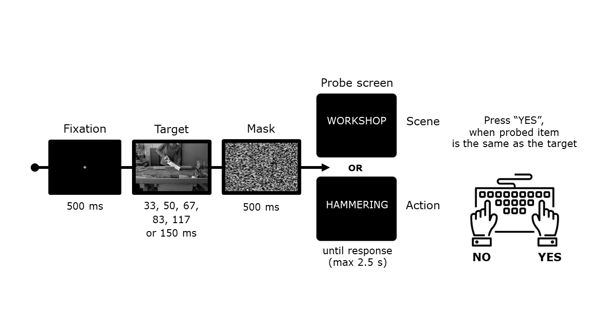
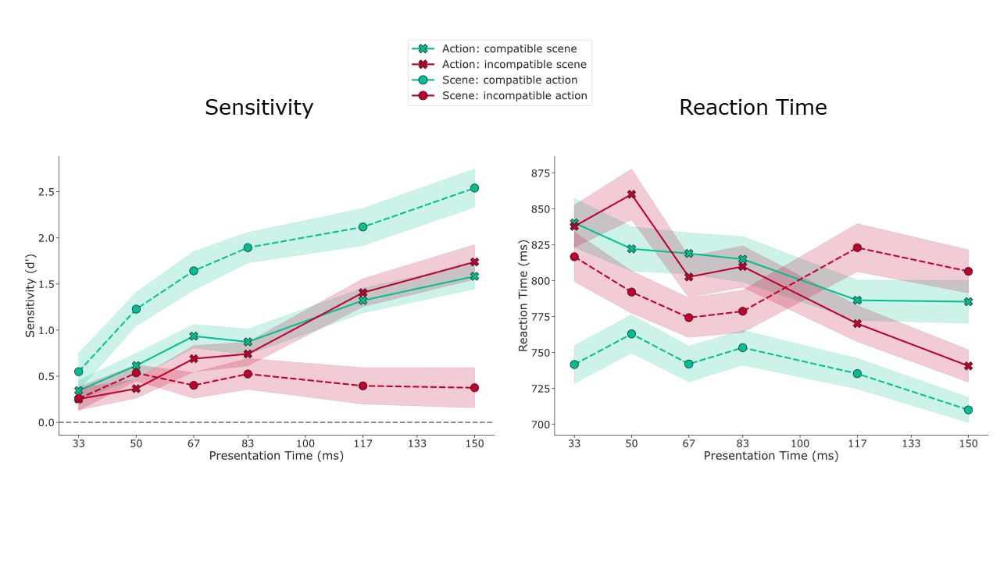

# Brief Actions in Context : Behavioral experiment [AinC]
## *How are briefly-presented actions percieved in compatible vs incompatible contexts?*

## Trial structure

[Hafri, Papafragou, Trueswell - Getting the gist of events (2013)](http://content.apa.org/journals/xge/142/3/880)

## Results

## Functionality

1. [Experiment](experiment/)
    - Stimuli
        - create masks : [`create_masks.ipynb`](experiment/create_masks.ipynb)
        - create stimulus definition file (std) :
            > `createStimDefs()`
    - Trial Definition
        - create trials for a full experiment using template blocks : 
            > [`fillTRD()`](experiment/fillTRD.m)
    - Run demo experiment:
        > [`runBriefAC(0, 'demo_right')`](experiment/runBriefAC.m)
2. [Data analysis](analysis/)
    - extract data from raw (.mat) files : `extractData.m`
    - pre-process data : `data_preprocessing.ipynb`
    - vizualize data : `data_visualization.ipynb`
    - statistics : `data_statistics.ipynb`
    
3. [Documentation](docs/)
    - Instructions
    - Forms & Questionaires

**For more details, see the [CAOs2023 poster](docs/Vrabie_poster_CAOs23.pdf).**

---

Derived from https://github.com/CogNeuroUR/ASF-examples